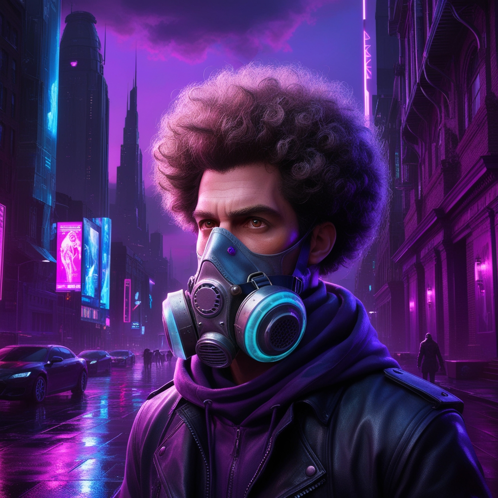

   
   <h1>Hello World! 😎✌️</h1>

## About me 👨‍💻
I'm Victor J. Torres Ferreyra, but you call me Quetzal Nocturno. I´m student of the last year of Computer Sysmtems Engineering , I'm learning a backend frameworks, networking and cloud service, like <a href="https://aws.amazon.com/es/">AWS</a>, <a href="https://azure.microsoft.com/">Azure</a> and my own solutions for cloud service and storage.

In My free time I listen music, read sci-fi novels and i update my knownledge about the frameworks that i used. I'm fan for Star Wars, Warhammer 40k and Warhammer Age of Sigmar.

## Languages and tools that i know

  
  
  
  
  
  
  
  

<!---
vjesus-ferreyra/vjesus-ferreyra is a ✨ special ✨ repository because its `README.md` (this file) appears on your GitHub profile.
You can click the Preview link to take a look at your changes.
--->
